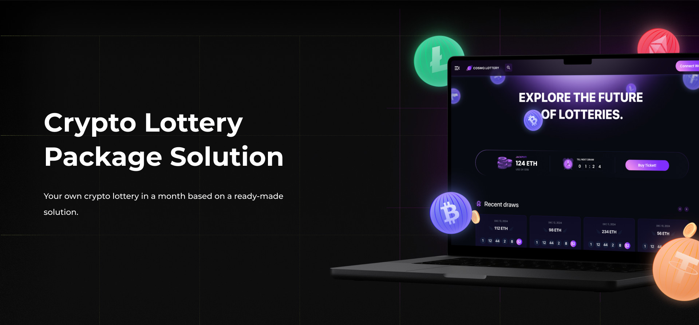

# Blockchain Crypto Lottery | Case Study & Custom App Solution

This project demonstrates the foundation of a crypto lottery application and serves as a case study for launching your own blockchain lottery. 

**Looking to build your own crypto lottery?** We provide a complete white-label solution tailored to your needs, enabling you to focus on marketing and growing your community while we handle the technology.

## Why This Solution?

Our Blockchain Crypto Lottery solution is designed for rapid deployment, cost efficiency, and scalability. Whether you’re a startup or an established business, this white-label product is the fastest and most affordable way to launch your crypto lottery app.

## Features Included in the Package

### Core Functionality

- **Wallet Integration**: Supports Trust Wallet, Wallet Connect, and Coinbase Wallet for seamless user authentication.
- **Multichain Support**: Works with Ethereum, BSC, Polygon, and many more.
- **Crypto Transactions**: Secure deposit and withdrawal via cryptocurrency.
- **Admin Panel**: Simplified control for managing app settings and operations.
- **Mobile Optimization**: Fully responsive for mobile devices.
- **Localization**: Multilingual support for global reach.
- **DDoS Protection**: Robust security for uninterrupted service.
- **CI/CD Integration**: Automates updates and deployments.
- **Marketing Tools**: Includes SEO optimizations, Google Analytics, and Microsoft Clarity for insights.

### Additional Features on Request

- Deposit & Withdrawal via Fiat (requires license)  
- Landing Page  
- Blog Integration  
- Telegram Bot or Mini App  
- Mobile Application (requires license)  
- Loot Boxes, Referral Systems, Daily Bonuses  
- Google Adsense Integration  
- Custom Features as per your needs  

## Technology Overview

We utilize cutting-edge technologies to ensure performance, scalability, and ease of use.

  
Front End (App & Admin Panel)

  <ul>
      <li>Next.js</li>
      <li>React.js</li>
      <li>Redux Toolkit</li>
      <li>TypeScript</li>
      <li>Wagmi</li>
      <li>Jest (Unit Testing)</li>
  </ul>

  
Back End

  <ul>
      <li>Node.js</li>
      <li>Express.js</li>
      <li>TypeScript</li>
      <li>MongoDB & Mongoose</li>
      <li>Swagger (API Documentation)</li>
      <li>Jest & Supertest (Testing)</li>
  </ul>

  
Blockchain

  <ul>
      <li>Solidity (Smart Contracts for Crypto Lottery)</li>
  </ul>

  
DevOps

  <ul>
      <li>Docker</li>
      <li>GitLab CI</li>
  </ul>

## Pricing Packages

|                  | Basic Package | NoFee Package | 
|------------------|---------------|---------------|
| Revenue Share    | 2%            | 0%            | 
| Maintenance Cost | Free          | $2,000/year   | 
| Community Size   | 1,000+        | 10,000+       | 
| Custom Design    | Colors Only   | Fully Custom  | 
| Initial Cost     | $5,000        | $20,000       | 

## Request a Demo

Experience the Crypto Lottery app in action! Contact us to see how we can customize this solution for your needs.  

- <a href="https://telegram.me/omisoft" target="_blank">Message Us on Telegram</a>  
- <a href="https://omisoft.net/contact-us?utm_campaign=web3-crypto-lottery&utm_medium=social&utm_source=github" target="_blank">Visit Our Website</a>  
- [Email Us Directly](mailto:hi@omisoft.net)  

## Frequently Asked Questions

  
How much does it cost?

  
We offer three pricing options:
 
  <ul>
      <li>**Basic Package**: $5,000 + 2% of revenue with free maintenance.</li>
      <li>**NoFee Package**: $20,000 + $2,000/year for maintenance.</li>
      <li>**Special Offer**: $0 upfront if you have a large community and are open to a revenue-sharing partnership.</li>
  </ul>

  
How long does it take to launch?

  
With our white-label solution, deployment takes less than a month—3-4 times faster than custom development.

  
Which networks are supported?

  
Our solution supports Ethereum, Arbitrum, Optimism, Polygon, BSC, Avalanche, and others. TON support can be added on request.

  
Can we host it on our servers?

  
Yes, we can configure CI/CD pipelines for seamless updates on your infrastructure.

## Next Steps

Ready to launch your own blockchain lottery? Let us help you turn this foundation into a fully customized app tailored to your needs.  

Check out other solutions we offer:  

- [Hamster Kombat Game](https://omisoft.net/demo/hamster-kombat-clone-script)  
- [White-Label NFT Marketplace](https://omisoft.net/demo/whitelabel-nft-marketplace-development)  
- [AI Content Generator](https://omisoft.net/demo/ai-content-generation)  
